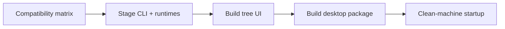

# Client integration

| Responsibility | Owner |
|---|---|
| UI and Tauri shell | Client repository |
| Memory operations and local identity | CLI |
| Protocol/output contract | Canonical contracts and CLI adapters |
| Retrieval/model execution | Core through SDK |
| Encrypted remote records | Server |

Before building:

1. Check `contracts/client-compatibility-matrix.json` and CLI artifact targets.
2. Obtain an compatible sidecar and stage its runtime manifest/resources.
3. Run the existing frontend checks.
4. Build the native desktop package with its platform dependencies.
5. Verify the packaged application on a clean environment.

| Local record | Writer |
|---|---|
| `session.json` | CLI registration/login |
| `client.json` | Client preferences shared with CLI |
| Local SQLite | CLI/application layer |
| Injection blocks | CLI managed-target implementation |

Do not duplicate key management or inference in the UI. Changes to CLI JSON or sync/auth behavior must be checked against both CLI and client consumers.

[Client](client.md) · [Contracts](contracts.md) · [Development](development.md)
