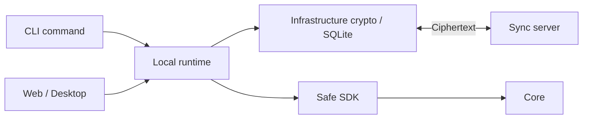
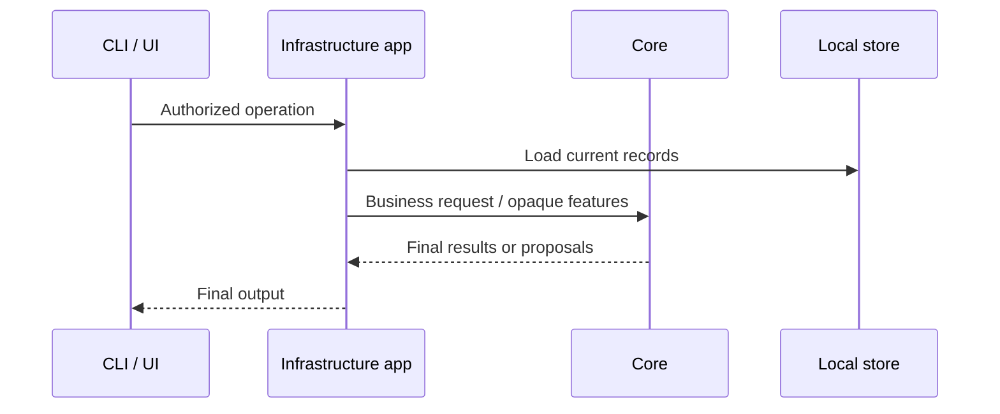

# Runtime flow

| Path | Flow |
|---|---|
| Write | Validate input → obtain Core proposals/features → authorize changes → encrypt and persist |
| Read | Load authorized local snapshots → Core selects final results/context → final output |
| Tree changes | Update encrypted parent metadata and local index together |
| Sync | Pull revisions/tombstones → apply conflict rules → push dirty records → save cursor |
| Injection | CLI template → managed block in the target AI tool |

The runtime owns the data-directory lock. Normal commands use the runtime when available. Direct maintenance requires stopping the runtime first; use the installed CLI's help for supported flags.

Derived rows must match their current source ciphertext, model and index generation. Record updates or model changes invalidate stale features; rebuild rather than treating incompatible artifacts as valid.

[Development](development.md) · [Contracts](contracts.md)
