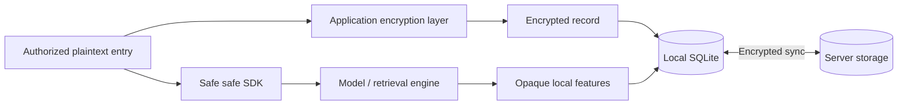

# Architecture

The local library is the working source of truth. The server stores encrypted records; local retrieval does not require a server request.

The resident runtime loads ONNX and performs inference in the same process.
One shared model session queues inference calls. Model files and CPU/GPU/NPU
selection are global. Account switching selects a different library and index,
while preserving those global settings. HTTP health and progress handlers remain
available while command and background threads perform model work.

Clients preserve existing runtime tokens on the initial health, RPC and stop
request. New loopback runtimes ignore the header; authenticated older runtimes
still require it. Removing server-side authentication does not remove client
upgrade compatibility. Host takeover verifies the runtime, stops it gracefully,
then waits for its process, listener and library lock before starting a successor.
Restricted clients cannot perform lifecycle operations.

Every published stable CLI version from 1.0.6 onward is an upgrade source in the
release validation matrix. The inventory is read dynamically, so each new stable
release becomes a source for later releases. Missing artifacts or failed checks
block publication. A 1.0.6 DEV artifact is an additional historical baseline
because a formal 1.0.6 artifact is unavailable in the current release registries.

| Trust boundary | Owns |
|---|---|
| Infrastructure client layer | Account keys, authorized plaintext, encryption, sync, database and HTTP |
| Core | Models, feature interpretation, retrieval, ranking and context policies |
| Server | Authentication and encrypted records; no client decryption keys |
| UI | Final results and authorized writes through CLI operations |

Local metadata and derived features are not part of the sync wire DTO. Feature artifacts are rebuildable local data, not encrypted secrets. Final scores and authorized plaintext remain observable at runtime.

| Operation | Result |
|---|---|
| Remember / update / forget | Write locally, then allow runtime background sync |
| Recall | Local final results from Core |
| Password changes | Update key wrapping rather than re-encrypting every memory |
| Delete | Sync a tombstone; preserve convergence across devices |

See [Data model](data-model.md), [Runtime flow](architecture-internals.md) and [Sync and keys](sync-and-keys.md).
