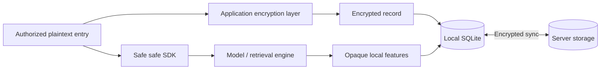

# Architecture

The local library is the working source of truth. The server stores encrypted records; local retrieval does not require a server request.

| Trust boundary | Owns |
|---|---|
| Infrastructure client layer | Account keys, authorized plaintext, encryption, sync, database and HTTP |
| Core | Models, feature interpretation, retrieval, ranking and context policies |
| Server | Authentication and encrypted records; no client decryption keys |
| UI | Final results and authorized writes through CLI operations |

Local metadata and derived features are not part of the sync wire DTO. Feature artifacts are rebuildable local data, not encrypted secrets. Final scores and authorized plaintext remain observable at runtime.

| Operation | Result |
|---|---|
| Remember / update / forget | Write locally, then allow runtime background sync |
| Recall | Local final results from Core |
| Password changes | Update key wrapping rather than re-encrypting every memory |
| Delete | Sync a tombstone; preserve convergence across devices |

See [Data model](data-model.md), [Runtime flow](architecture-internals.md) and [Sync and keys](sync-and-keys.md).
