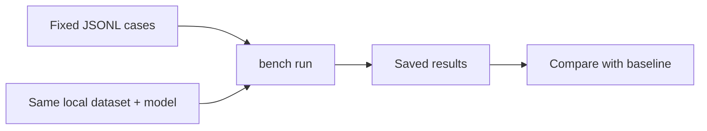

# Retrieval benchmarks

`rsrs bench` compares observable retrieval results on a fixed local evaluation set. It does not document the Core's ranking implementation.



```sh
rsrs bench mine --out retrieval.jsonl
rsrs bench run retrieval.jsonl --save baseline.json
rsrs bench run retrieval.jsonl --baseline baseline.json
```

## Evaluation format

```json
{"query":"database backup","expect":["12345678"],"project":null,"note":"optional"}
```

| Field | Meaning |
| --- | --- |
| `query` | Query text |
| `expect` | Expected record identifiers or prefixes; any matching result counts |
| Empty `expect` | Negative example: no result is expected |
| `project` | Optional project scope |
| `note` | Optional evaluation note |

Blank lines and lines beginning with `#` are skipped. Keep expected identifiers current when records are deleted or merged.

| Metric | Meaning |
| --- | --- |
| Hit at 1 / 3 / top-k | Fraction of positive cases with a match within the cutoff |
| MRR | Mean reciprocal rank; misses contribute zero |
| Empty positive results | Positive cases returning no result |
| Negative noise | Negative cases returning results |

## Reproducibility

| Hold constant | Record with the comparison |
| --- | --- |
| Data | Dataset identity and size |
| Model | Model identity and version |
| Software | CLI and binary SDK version |
| Evaluation | Same cases, scope and top-k |
| Environment | Relevant configuration and hardware |

The benchmark path does not write query logs or increment recall heat. Normal `recall` has different side effects. Compare equivalent runs; a saved score alone does not establish performance on another machine or platform.

Use `bench --help` and `bench run --help` for current output and control options. Published benchmark reports should omit private memory text and sensitive identifiers.
