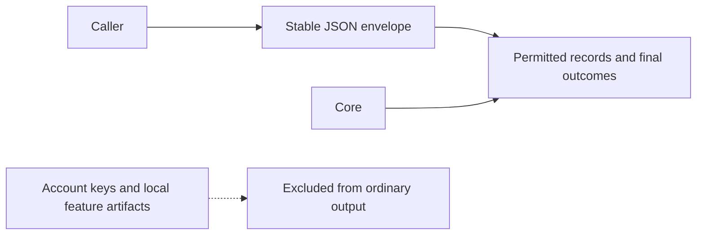

# CLI JSON API

Use `--json` when integrating Respire with scripts, agents or applications. Parse the JSON envelope rather tha matching human-readable messages.

```json
{
  "command": "recall",
  "status": "ok",
  "summary": {},
  "items": [],
  "actions": [],
  "errors": [],
  "details": null,
  "related": []
}
```

| Field | Purpose |
| --- | --- |
| `command` | Executed command |
| `status` | `ok`, `warn`, `fail`, `skip` or `pending` |
| `summary` | Counts, identifiers and command-level outcome |
| `items` | Compact result rows |
| `actions` | Follow-up actions |
| `errors` | Reported failures |
| `details` | Command-specific permitted data |
| `related` | Bounded recall associations: ID, title, source ID and relation; empty for other commands |

| Exit code | Meaning |
| --- | --- |
| `0` | Completed, including an ordinary empty result |
| `2` | Warning or pending decision |
| `1` | Argument, session, storage, transport or execution failure |

Read the result envelope for nonzero exits too: a pending candidate decision differs from a failed write. Keep standard error separate from standard output.

## Result shapes

| Command family | Typical data |
| --- | --- |
| `status`, `doctor`, `audit` | Summary and diagnostic rows |
| `recall` | Identifiers, titles and final result scores; permitted record details |
| `list`, `show`, `chain`, `tree` | Record or relationship data |
| `remember`, `attach` | Action and identifier; no secret payload |
| `sync`, `sync-*` | Counts, conflicts and retained versions |
| `config`, `agent-config` | Nonsecret configuration |
| `import`, `export`, `backup` | Paths and counts |

The canonical machine contracts live in the repository's `contracts/` directory. See [contracts](contracts.md) for ownership and compatibility rules.

Recall retains its primary hit order and scores in `details`. Its separate
`related` array contains title-only associations; `summary.related` counts them.
Recall detail rows indicate a live replacement with `superseded_by`.
Clients should accept a missing `related` field from older runtimes as an empty
array. See [memory associations](associations.md) for write and upgrade rules.

## Data boundaries



Ordinary output excludes ciphertext, nonces, wrapped keys, authentication tokens and local feature artifacts. Commands explicitly designed to reveal or export secrets require their own options; handle their output as sensitive data.

The SDK's internal business requests are separate from this CLI API. Applications should consume command results rather than construct internal vectors or ranking requests.
