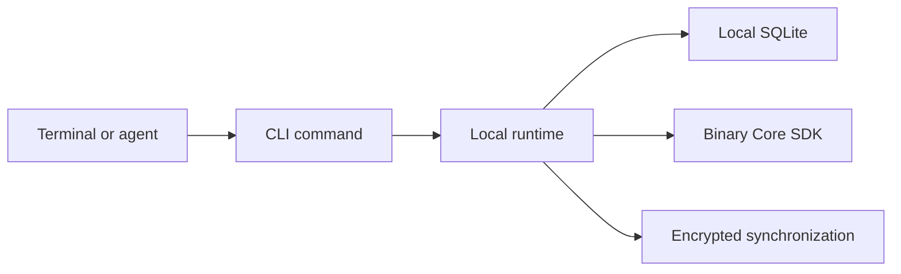

# CLI

`rsrs` is the sole Respire CLI command. It manages local memories, encryption, synchronization and integrations. Retrieval and memory policies execute in the Core through the binary SDK; `respire` and `rs` command aliases are not provided.

```sh
rsrs help
rsrs --help
rsrs recall --help
rsrs status --json
```

The installed executable's help is the source of truth for available options. See [CLI JSON](cli-api.md) for automation.

## Everyday commands

| Task | Command | Effect |
| --- | --- | --- |
| Save | `remember "content" --title "title"` | Checks candidates before writing |
| Find | `recall "query" --titles --json` | Returns matching titles and identifiers |
| Read | `show <id> --json` | Reads the selected record |
| Browse | `list`, `tree`, `chain <id>` | Lists records and relationships |
| Edit | `update <id> --content "content"` | Creates a new local content revision |
| Delete | `forget <id>` | Writes a tombstone |
| Restore | `restore <id>` | Restores a retained record |
| Check | `doctor`, `audit` | Reports local problems |

Read candidates before deciding whether to merge, attach or create a new record. Commands supporting short identifiers require an unambiguous prefix.

## Management

| Area | Commands |
| --- | --- |
| Relationships | `attach`, `promote`, `demote`, `resort` |
| Maintenance | `candidates`, `defrag`, `tree-cure`, `tree-deepen`, `tree-float`, `repack`, `reembed` |
| Data transfer | `import`, `export`, `backup`, `share`, `share-import` |
| Accounts | `keygen`, `register`, `login`, `logout`, `account`, `session` |
| Synchronization | `sync`, `sync-conflicts`, `sync-resolve`, `sync-history`, `sync-restore`, `sync-reset` |
| Integrations | `inject`, `plugin`, `mcp`, `web` |
| Configuration | `config`, `agent-config`, `model`, `status` |

Use each command's help before changing data. Several maintenance commands produce a plan first and require an explicit execution option. Export and share files contain plaintext; a database backup does not replace a key backup.

## Runtime and output



| Interface | Contract |
| --- | --- |
| Standard output | Final result; one JSON object with `--json` |
| Standard error | Progress, diagnostics and warnings |
| `--client-only` | Connects to the existing authenticated local runtime |
| `--direct` | Direct local execution; follow the installed command's lock requirements |

## Configuration compatibility

The product is named Respire, under risense-ai. The sole command, native binary and sidecar prefix are `rsrs`. Repository/crate names remain `respire-*` and `respire_*`; the Core ABI remains `rs_core_*`. The default data root is independently `~/.respire` and the runtime port is `15169`; no automatic old-session migration or connection to the old `15168` runtime occurs. Existing `ONEMEMORY_*` variables remain explicit compatibility options. SDK controls use `RESPIRE_CORE_SDK_DIR` and `RESPIRE_CORE_TEST_MODE`; there is no new `RS_*` environment namespace.

The configured default API is `https://api.rsrs.rs`; `--addr` can select a local server. Configured domains are not proof of live deployment.

| Variable | Purpose |
| --- | --- |
| `ONEMEMORY_DATA_DIR` | Select a separate local data directory |
| `ONEMEMORY_NO_AUTOSYNC=1` | Disable automatic synchronization |
| `ONEMEMORY_ADDR`, `ONEMEMORY_TOKEN` | Remote connection configuration |
| `ONEMEMORY_JSON=1` | Request JSON output |
| `ONEMEMORY_MODEL_DIR`, `ONEMEMORY_M3_DIR` | Explicit model directories |
| `ONEMEMORY_RERANKER_DIR` | Explicit reranker directory |

See [synchronization and keys](sync-and-keys.md), [agent integration](injection.md) and [benchmarks](benchmark.md).
