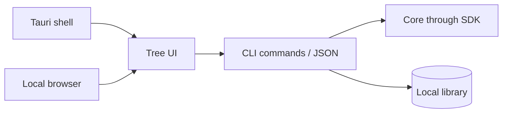

# Client

The desktop client uses Tauri and the same tree UI as local Web. Memory operations go through the CLI; the client does not contain the memory engine.

| View | Behavior |
|---|---|
| Search | Local retrieval and category filters |
| Tree | Expand roots/subtrees and inspect relationships |
| Detail | Entry content, parent/children and authorized edits |
| Create | Inspect duplicate/parent proposals before deciding |
| Maintenance | Analyze structure, rebuild indexes and export/import |
| Account | Login, recovery, autosync and manual sync |
| Injection | Detect target tools and update managed blocks |

The local library and key handling are shared with the CLI. Server logout does not erase local records. Recovery-key export is sensitive, and JSON entry export is plaintext.

## Packaging boundary

| Item | Required |
|---|---|
| CLI sidecar | Compatible version from the artifact contract |
| Runtime files | `core-runtime.json` and its validated runtime resources |
| Models | Matching model resources and their licenses |
| Desktop resources | UI, platform runtime and installer configuration |
| Compatibility | Canonical client/CLI target mapping |

A fresh client source clone does not supply a compatible CLI binary. Obtain a compatible release before staging a sidecar. Windows packages must include required runtime libraries next to the sidecar; see [Windows packaging](windows-packaging.md).

[Client integration](CLIENT-GUIDE.md) · [Local Web](product/web.md)
