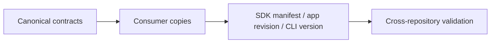

# Contracts

Canonical machine-readable contracts live in repository-root `contracts/`.

| Contract | Canonical file | Consumer |
|---|---|---|
| Core distribution / operations | `core-api.json` | Core and safe SDK |
| C ABI / JSON DTOs | `core-abi/` | Core header and safe SDK adapters |
| Server HTTP | `openapi.yaml` | Server and API clients |
| CLI packages / sidecars | `cli-artifact-manifest.json` | CLI packaging |
| Desktop compatibility | `client-compatibility-matrix.json` | Client staging |



```sh
node contracts/validate.mjs
```

| Rule | Requirement |
|---|---|
| ABI | Business C interface; no public vector/mathematics API |
| Resource boundary | Host supplies model/tokenizer and opaque index bytes; Core does not accept storage paths or open files/databases |
| SDK | Pin target, compiler, manifest hash and runtime files |
| Server | Pin the infrastructure app crate, not the CLI executable |
| Sidecar | Include its runtime libraries and notices |
| Breaking change | Coordinate producer and consumer pins before release |

Translation does not change operation names, status codes, JSON fields, binary names or target mapping. Contract validity does not prove a release is available.

[Development](development.md)
