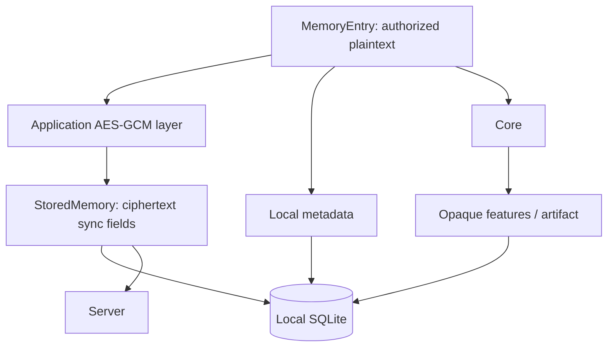

# Data model

Respire uses a separate `~/.respire` data root. It does not automatically read an older product's session, copy keys or migrate its database. Existing `ONEMEMORY_*` option names may remain explicit compatibility interfaces; they do not imply shared default state.

| Local item | Purpose |
|---|---|
| `~/.respire/onememory.db` | Encrypted records plus local metadata and feature indexes; compatibility filename inside a separate root |
| `session.json` | Identity, address, token and key material |
| `client.json` | Client preferences, server address and autosync settings |
| `lock.db` | Exclusive local runtime lock |
| `~/.respire/models/` | Default tokenizer/model resources; execution remains inside Core |
| `~/.respire/inference.json` | Separate Respire inference-engine settings |

`ONEMEMORY_DATA_DIR` selects the data root. Do not commit session files, database copies or recovery material.

Models and inference settings do not automatically fall back to older `yishi` or `.onememory` directories. An explicitly configured `ONEMEMORY_DATA_DIR` changes the selected root; explicit model-directory options remain compatible overrides.

The local runtime defaults to port `15169`; it does not contact an older runtime on `15168` automatically. The desktop application identifier is `ai.risense.respire`. Cryptographic derivation and sync formats remain compatible; moving identities or records still requires an explicit user decision.

| Plaintext field | Meaning |
|---|---|
| `id` | Client-generated record ID |
| `kind` | Memory category; wire casing is defined by the typed protocol |
| `tags / title / content` | Searchable/displayed entry content |
| `user / computer / project` | Ownership and local scope |
| `created_at / updated_at` | Record timestamps |
| `parent_id` | Empty for a root; otherwise the causal parent |
| `importance` | New entries use `important` or `trivial`; legacy values remain readable |
| `device / modified_by` | Creation and last-update device attribution |

| Server-visible sync field | Purpose |
|---|---|
| `id / user` | Record identity and account routing |
| `ciphertext / nonce` | Encrypted payload |
| `embedding_enc` | Existing encrypted feature compatibility field |
| `updated_at / deleted` | Conflict resolution and tombstones |

Local metadata, `local_embedding`, `local_chunks` and `local_artifact` are skipped by sync serialization. Infrastructure code treats feature payloads as bytes. Artifacts are bound to source records/model generation and can be rebuilt; their internal schema is not public.

Exported entry JSON is plaintext. Imports may create new IDs and rebuild parent mappings; protect exported files accordingly. See [CLI](cli.md) and [Sync and keys](sync-and-keys.md).
