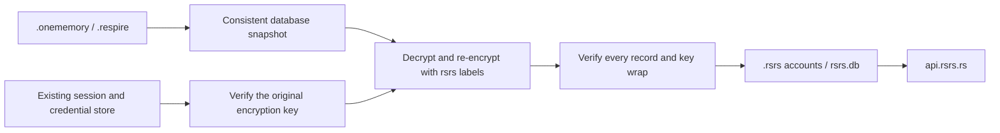
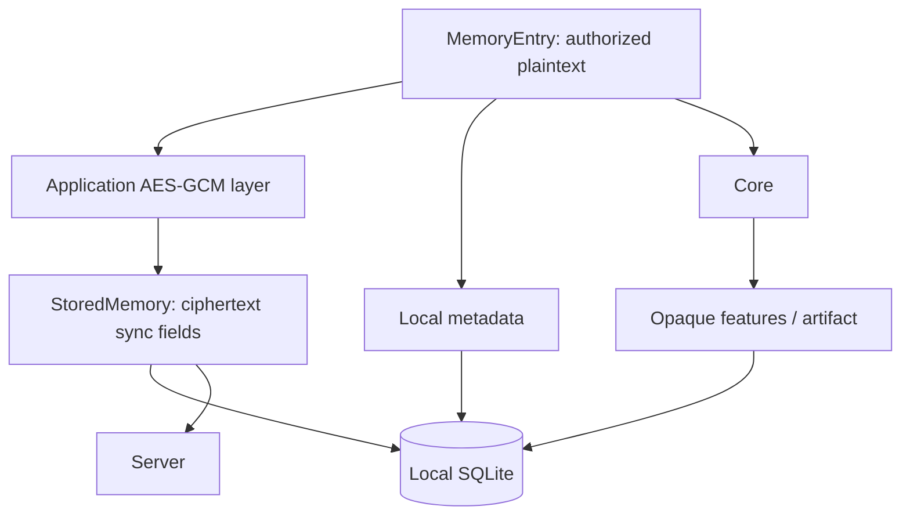

# Data model

Respire uses `~/.rsrs`. Startup preserves the current account, API preferences, data and keys without copying old accounts. Explicit migration discovers supported accounts in `~/.onememory`, `~/.respire` and legacy-format `.rsrs` profiles; the user selects a source and destination. Original directories remain intact. Current options use `RSRS_*`; `ONEMEMORY_*` and old `RESPIRE_*` options are read-only compatibility aliases. A present current option takes precedence.

| Local item | Purpose |
|---|---|
| `~/.rsrs/rsrs.db` | New-format encrypted records, local metadata and feature indexes; existing `onememory.db` remains readable until explicit migration |
| `session.json` | Identity, address, token and key material |
| `client.json` | Client preferences, server address and autosync settings |
| `lock.db` | Exclusive local runtime lock |
| `~/.rsrs/models/` | Default tokenizer/model resources |
| `~/.rsrs/inference.json` | Inference-engine settings |

`RSRS_DATA_DIR` selects the data root. Do not commit session files, database copies or recovery material.

An explicitly configured `RSRS_DATA_DIR` selects that directory. Explicit model-directory options remain compatible overrides.

The local runtime defaults to port `15169`. Explicit migration snapshots its chosen source; runtime takeover is a separate host operation that verifies the listener identity and waits for process, port and database-lock release. The desktop application identifier is `ai.risense.respire`. New accounts and accounts that have completed explicit migration write encrypted values with a `rsrs:v1:` marker and `rsrs:*` HKDF labels. Unmigrated libraries keep their original read and write format until the user explicitly migrates them; startup and ordinary writes do not convert them. Migration leaves the original source intact. Unmarked old values retain their original decryptor. Older clients cannot decrypt new-format ciphertext; update each client before migrating and synchronizing the account.

## Existing accounts

Run `rsrs migrate` to list source IDs, then `rsrs migrate --source <source-id> --account <new-name>` to migrate a selected account, or use **Migrate old version** in the TUI. Backup-only directories are not account sources. Stable source identity and completion receipts prevent reimport when source ordering changes. Existing destinations are refused; migration does not switch the active account. Doctor and TUI suggest only pending sources and never start migration automatically.

Migration retains usernames, login passwords, original super Keys, record IDs, metadata and pending changes. It recalculates internal derived keys, re-encrypts records and rewraps the unchanged URK using the original user factors. It does not reset a vault or generate replacement super Keys. The old immutable sync journal remains in the original library; the new projection queues new operations while preserving acknowledged base revisions. Any undecryptable record, including a deleted record, prevents full migration and its completion marker. Only known obsolete official API addresses are rewritten in the imported copy; custom addresses and the active account's API preferences remain unchanged.

Saved credentials can unlock the existing account without another login. If a session has expired and its login password was never saved, sign in with the original account password. If the original decryption secret is no longer available in the operating-system credential store, use the original recovery material. Copying an encrypted database alone cannot reconstruct a missing secret.

The operating system may request permission to access an existing credential. If an older runtime is still writing, migration preserves a consistent snapshot; later unsynced writes remain in the original directory. Unknown external data directories and early demo database formats require explicit migration with the original version's export/import tools. Unsupported data is left intact rather than replaced.

| Plaintext field | Meaning |
|---|---|
| `id` | Client-generated record ID |
| `kind` | Memory category; wire casing is defined by the typed protocol |
| `tags / title / content` | Searchable/displayed entry content |
| `user / computer / project` | Ownership and local scope |
| `created_at / updated_at` | Record timestamps |
| `parent_id` | Empty for a root; otherwise the causal parent |
| `supersedes / superseded_by` | Forward replacement edge and reverse hint; default empty |
| `see_also` | Explicit related record IDs; default empty array |
| `importance` | New entries use `important` or `trivial`; legacy values remain readable |
| `device / modified_by` | Creation and last-update device attribution |

| Server-visible sync field | Purpose |
|---|---|
| `id / user` | Record identity and account routing |
| `ciphertext / nonce` | Encrypted payload |
| `embedding_enc` | Existing encrypted feature compatibility field |
| `updated_at / deleted` | Conflict resolution and tombstones |

Local metadata, `local_embedding`, `local_chunks` and `local_artifact` are skipped by sync serialization. Infrastructure code treats feature payloads as bytes. Artifacts are bound to source records/model generation and can be rebuilt; their internal schema is not public.

Exported entry JSON is plaintext. Imports may create new IDs and rebuild parent mappings; protect exported files accordingly. See [CLI](cli.md) and [Sync and keys](sync-and-keys.md).

Relationships remain inside encrypted payloads; the sync transport does not gain
plaintext relationship fields. Import/share remap included targets, and local
`recall_pairs` evidence is not synced. Upgrade all writers of a shared library
before enabling relations, because old writers can discard unknown fields when
resealing. See [memory associations](associations.md).
