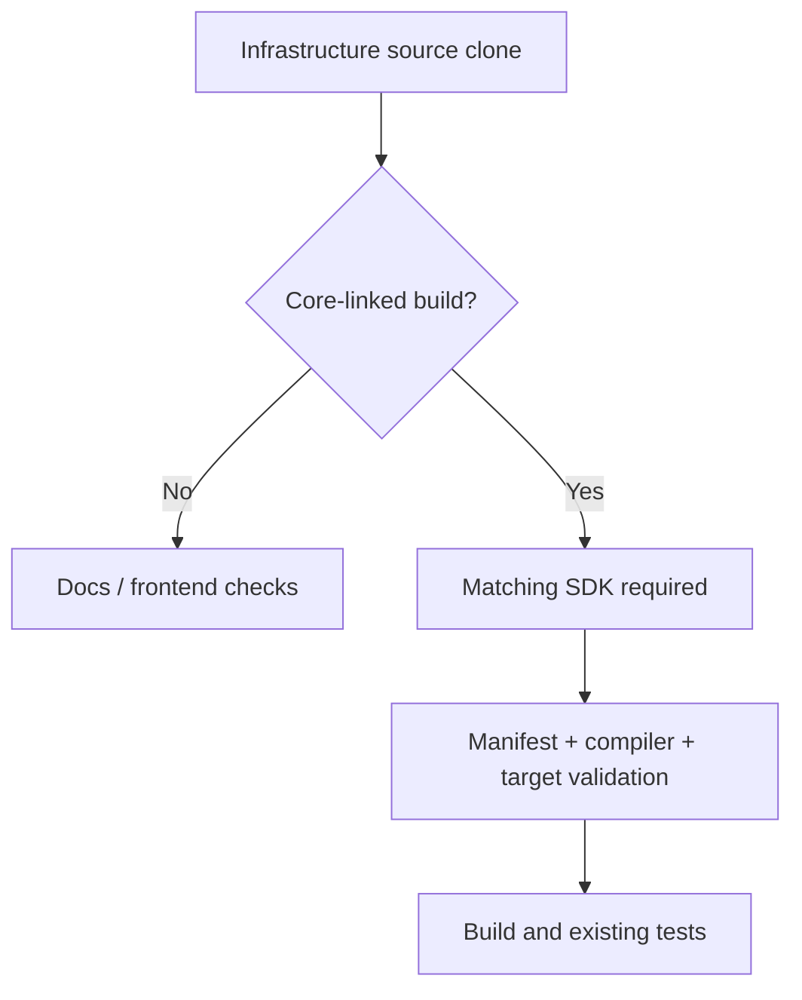

# Development

The docs and frontend can be developed independently. CLI/server builds require a compatible, licensed Core SDK in addition to infrastructure source.

| Repository | Existing check |
|---|---|
| Docs | `node contracts/validate.mjs`, `npm run build` |
| CLI | `cargo test --locked -p respire` after SDK setup |
| Infrastructure crates | Their existing Cargo tests after SDK setup |
| Server | `cargo test --locked -p respire_service`; database integration checks need PostgreSQL |
| Client UI | Existing tests/build in `client/tree-ui` |
| Desktop | Staged compatible CLI sidecar, runtime resources and platform dependencies |

## SDK setup

| Step | Requirement |
|---|---|
| Toolchain | Use the repository's pinned Rust toolchain |
| Lock | Match `sdk/core-sdk.lock.json` manifest SHA-256 |
| Local SDK | Set `RSRS_CORE_SDK_DIR` to a complete SDK directory |
| Download helper | `node scripts/fetch-core-sdk.mjs <target-triple> [output-directory]`; requires a configured download URL or complete local SDK |
| Build validation | Exact compiler release/commit, ABI, target, panic mode, CRT and file hashes must match |
| Test fixture provider | Set host `RSRS_CORE_TEST_MODE=1` only for existing fixture tests; the SDK passes explicit `test_mode: true`, and Core never reads this variable |
| Distribution | Stage runtime libraries and third-party notices, not just an executable |

Keep test data in a separate data directory. The SDK test provider is not a production model fallback.

For CLI builds, choose one of the seven [CLI platform targets](getting-started.md#cli-platforms). Linux GNU and musl targets require their corresponding SDK/runtime artifacts; do not substitute a GNU SDK for a musl build or vice versa. `RSRS_LIBC` selects the npm launcher's installed binary, not the Rust compilation target. Target definitions do not imply published binaries or completed platform validation.

| Infrastructure source path in CLI | Responsibility |
|---|---|
| `crates/protocol` | Shared data types |
| `crates/crypto` | Keys and record encryption |
| `crates/storage` | Local store and sync support |
| `crates/app` | Application orchestration |
| `crates/core-sdk` | Safe Core adapters |
| `cli` | Product executable and interfaces |

Use existing checks appropriate to the change. Preserve error causes and license notices; do not add `.unwrap()` / `.expect()` in Rust.

[Windows packaging](windows-packaging.md)
