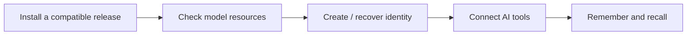

# Getting started



| Installation route | Requirement |
|---|---|
| npm | `@rsrsai/cli` launcher and matching platform package |
| Desktop installer | Compatible assets in [Respire Releases](https://github.com/risense-ai/respire-releases/releases) repository |
| Source | Infrastructure source plus a matching Core SDK |

For a version available in the package registry, choose one package manager:

```sh
npm i -g @rsrsai/cli
pnpm add -g @rsrsai/cli
```

Both package managers install the `rsrs` command. For source builds, see [Development](development.md).

## CLI platforms

These are artifact targets, not a list of published packages. Confirm that the selected version and platform package are available before installation.

| Platform | npm platform package | Rust target |
| --- | --- | --- |
| Linux x64, musl (default) | `@rsrsai/linux-x64` | `x86_64-unknown-linux-musl` |
| Linux ARM64, musl (default) | `@rsrsai/linux-arm64` | `aarch64-unknown-linux-musl` |
| Linux x64, glibc | `@rsrsai/linux-x64-gnu` | `x86_64-unknown-linux-gnu` |
| Linux ARM64, glibc | `@rsrsai/linux-arm64-gnu` | `aarch64-unknown-linux-gnu` |
| macOS Apple Silicon | `@rsrsai/macos-arm64` | `aarch64-apple-darwin` |
| Windows x64 | `@rsrsai/win-x64` | `x86_64-pc-windows-msvc` |
| Windows ARM64 | `@rsrsai/win-arm64` | `aarch64-pc-windows-msvc` |

Linux defaults to the musl package. Select glibc explicitly on a compatible glibc host; the same launcher setting applies to npm and pnpm:

```sh
RSRS_LIBC=glibc rsrs doctor
RSRS_LIBC=musl rsrs doctor
# Keep the selection for subsequent commands in this shell:
export RSRS_LIBC=glibc
```

GNU packages require a compatible glibc host and do not run on Alpine. If optional dependencies were omitted, install the selected platform package at the same version as `@rsrsai/cli`. Intel Mac is not an artifact target.

## First commands

After installing a compatible CLI:

```sh
rsrs --version
rsrs help
rsrs doctor
rsrs --help
```

| Identity | Command |
|---|---|
| First cloud account | `rsrs register --user <name> --pass <login-password> --super <recovery-password>` |
| Existing local account | `rsrs login --user <name> --pass <login-password>` |
| New device | Use the recovery options described by `rsrs login --help` and [Sync and keys](sync-and-keys.md) |
| Local only | `rsrs keygen --pass <password>` |

Keep recovery material outside Git and chat logs. A server cannot recover a lost client decryption secret. Do not replace existing keys merely to fix a login problem.

The configured default API is `https://api.rsrs.rs`. For a local development server use `--addr http://127.0.0.1:8787`.

Respire uses `~/.rsrs` and runtime port `15169`. On startup, it discovers existing `~/.onememory` and `~/.respire` accounts and copies their local data, settings and available credentials into the new directory. The original directories remain intact. Migrated accounts use `https://api.rsrs.rs`; an explicit data-directory override selects that directory instead of running default-directory migration. See [Data model](data-model.md) for migration and recovery details.

```sh
rsrs inject --targets
rsrs inject --id codex
rsrs remember "A reusable decision for this project" --type decision --title "Project decision"
rsrs recall "project decision" --limit 3
rsrs tree
```

A duplicate proposal is not a completed write: inspect it and choose the appropriate action. [Injection](injection.md) · [Walkthrough](walkthrough.md) · [FAQ](faq.md)
