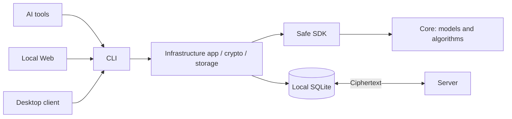

# Respire · rsrs

Local-first memory for AI tools: keep a working library on your device, retrieve locally and synchronize encrypted records across devices. Respire uses the sole CLI command **rsrs**; its repository organization is **risense-ai**.

| Component | Responsibility |
|---|---|
| CLI | Commands, authorization, injection, JSON output and local runtime |
| Core | Model execution, retrieval, ranking, deduplication and context selection |
| Infrastructure crates | Protocol, cryptography, persistence, sync and safe SDK adapters |
| Server | Authentication and per-user ciphertext storage |
| Web / Desktop | The same tree interface, using CLI operations |
| Website | Product information; separate from the memory client |

[Get started](getting-started.md) · [Explore the architecture](architecture.md) · [Build prerequisites](development.md)
