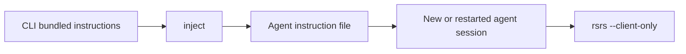

# Agent integration

`rsrs inject` installs the CLI's bundled instructions into supported agent configuration files. The authoritative instruction text is maintained in the CLI repository, not copied into this documentation site.

```sh
rsrs inject --targets
rsrs inject --id codex
rsrs inject --remove --id codex
```

Run `inject --targets` to inspect resolved paths and detection state on the current machine. Preset paths are conventions; an agent with custom configuration may need its own instruction reference.

| Integration mode | Behavior |
| --- | --- |
| Managed block | Replaces only the block between Respire markers |
| Reference | Writes an instruction file and updates the supported configuration reference |
| Full-file target | Uses the instruction text as the target's contents |



| Check | Action |
| --- | --- |
| Target missing | Inspect `inject --targets` and the agent's real configuration path |
| Multiple configuration files | Check which file and instruction list the agent loads |
| Existing long-running session | Restart or open a new session after changing instructions |
| Instruction source changed | Rebuild or update the CLI, then run `inject` again |
| Runtime connection failure | Inspect the local runtime and authentication; do not silently switch execution modes |

Managed blocks use `<!-- respire:begin -->` and `<!-- respire:end -->`. Preserve unrelated instructions outside the block. Review a full-file target before installation.

See [CLI](cli.md), [CLI JSON](cli-api.md) and [plugins](plugin-dev.md).
