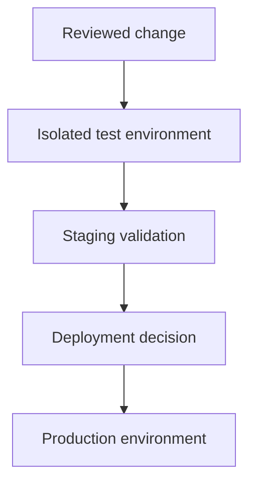

# Environment separation

Deployment environments must use separate database state, credentials and explicitly selected application versions. This page describes the separation model; it is not a directory of internal hosts or a statement of current production status.

| Respire target | Assigned URL |
|---|---|
| Website | `https://rsrs.rs` |
| User dashboard | `https://dash.rsrs.rs` |
| Admin dashboard | `https://admin.rsrs.rs` |
| API | `https://api.rsrs.rs` |

These domains are configured separately from older products. Local API development uses `http://127.0.0.1:8787`; local identity/runtime state is rooted at `~/.rsrs` with runtime port `15169`. Startup migrates previous local accounts while retaining their original directories.

| Environment | Data | Purpose |
| --- | --- | --- |
| Development | Synthetic or isolated data | Iteration and integration |
| Staging | Approved isolated copy | Upgrade and recovery rehearsal |
| Production | Live data | Explicitly controlled deployment |

| Resource | Separation requirement |
| --- | --- |
| Postgres | Separate database or volume and credentials |
| Secrets | Scoped to the intended environment |
| API and website | Route explicitly to their respective services |
| Images | Select immutable or explicitly versioned artifacts |
| Backups | Store independently; test restoration away from live data |

Publishing a Git branch is separate from deploying a service. Inspect the actual repository workflow triggers before making deployment assumptions.

See [self-hosting](server-deployment.md) for deployment prerequisites.
