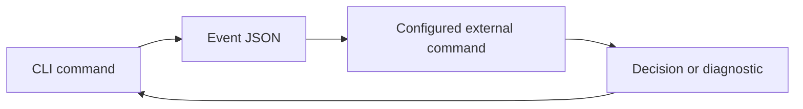

# Plugins

A hook plugin is a command launched by the CLI. It receives a JSON event on standard input and returns an exit status and, for a pre-hook, an optional decision.



Configure hooks in `<data directory>/plugins.json`:

```json
{
  "hooks": {
    "pre-remember": [
      {"cmd":"python3 sensitive-scan.py","timeout_ms":3000,"on_error":"block"}
    ]
  }
}
```

| Field | Contract |
| --- | --- |
| `cmd` | Required command; `cmd.exe` on Windows, `sh -c` on Unix |
| `timeout_ms` | Default 5000 milliseconds |
| `on_error` | `block`, `warn` or `skip`; defaults differ between pre and post hooks |

| Event | Payload summary | May veto? |
| --- | --- | --- |
| `pre-remember` | Title, classification metadata and a bounded content preview | Yes |
| `post-remember` | Identifier, title and importance | No |
| `post-recall` | Query, project and hit identifiers / final scores | No |
| `post-forget` | Identifier | No |
| `post-sync` | Pull and push counts | No |

The envelope is `{"event":"...","ts":"...","data":{}}`. The child receives a restricted environment containing basic process variables and `ONEMEMORY_HOOK_EVENT`; account configuration and credentials are not inherited.

For a pre-hook, the final standard-output line may be:

```json
{"verdict":"block","reason":"review required"}
```

An explicit block verdict remains a veto even when failure handling is `skip`. Post-hook standard output is not a write decision. Treat event payloads as sensitive: previews and queries may contain private text.

```sh
rsrs plugin list
rsrs plugin test pre-remember --payload '{"content_head":"example","title":"test"}'
```

`plugin test` actually runs the configured command. Hooks should exit promptly, be idempotent where appropriate and avoid printing secrets. The timeout does not guarantee terminating an external child process. Plugins should not open the internal database or recursively invoke the CLI from a hook.

See [integration options](plugin-ecosystem.md) and [CLI JSON](cli-api.md).
