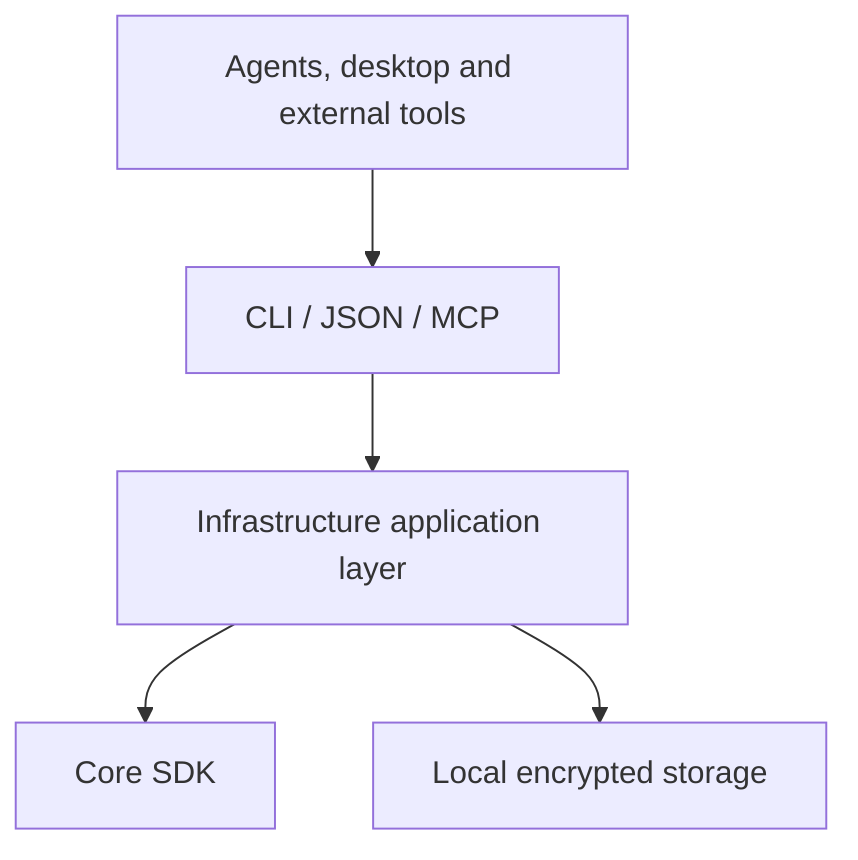

# Integration options

Use the supported CLI contract to add workflows around Respire without depending on internal database structures or retrieval internals.

| Integration | Interface | Typical use |
| --- | --- | --- |
| External tool | CLI `--json` | Reports, exports and visualization |
| Hook | `plugins.json` event commands | Pre-write checks and post-operation notifications |
| Agent instructions | `rsrs inject` | Recall-before-work and save-after-work behavior |
| MCP | `rsrs mcp` over standard I/O | Supported memory tools for compatible clients |
| Desktop | CLI sidecar | User interface over the same command behavior |

| Rule | Reason |
| --- | --- |
| Parse machine output | Avoid coupling to translated display text |
| Keep account secrets private | Hooks and external tools need only their permitted inputs |
| Do not read internal database files | Storage format is not an integration API |
| Make side effects explicit | Export, import and plugin execution have different effects |
| Use matching SDK artifacts | Match the target, toolchain, ABI and manifest hashes |

This list describes existing interface types, not a promise of a plugin marketplace or arbitrary in-process extensions. Check each command's help for the supported tool set.

See [plugins](plugin-dev.md), [agent integration](injection.md), [CLI](cli.md) and [CLI JSON](cli-api.md).
