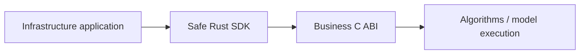

# Core

Core is a Rust engine distributed through a business C ABI and a safe Rust SDK.

| Core | Infrastructure |
|---|---|
| Chunking and feature interpretation | Model download/checksums/progress |
| Semantic retrieval and ranking | Account keys and encryption |
| Reranking and deduplication | SQLite and synchronization |
| Tree/context proposals | HTTP and authorized mutations |
| BGE / reranker / ONNX execution | Commands, UI and final-result formatting |

Inputs are authorized business material and opaque features; outputs are final results or proposals. There is no public vector, cosine or intermediate-rank API.

| Integration rule | Requirement |
|---|---|
| Distribution | Binary SDK; consumed through the C ABI |
| Ownership | Core owns returned buffers; SDK uses RAII |
| Pinning | Manifest hashes, exact compiler and matching target/CRT |
| Compatibility | Preserve legacy encrypted feature and storage formats |
| Licensing | Core SDK permission is separate from infrastructure-source licensing |

Respire inference settings default to `~/.rsrs/inference.json`, and models to
`~/.rsrs/models/`. Startup migrates existing `.onememory` and `.respire` settings
and model resources. Explicit data/model-directory overrides remain available;
these paths do not change the cryptographic derivation or sync format.

[Contracts](../contracts.md) · [Development](../development.md)
