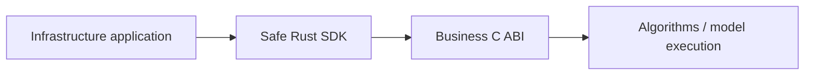

# Core

Core is a Rust engine distributed through a business C ABI and a safe Rust SDK.

| Core | Infrastructure |
|---|---|
| Chunking and feature interpretation | Model download/checksums/progress and model-byte loading |
| Semantic retrieval and ranking | Account keys and encryption |
| Reranking and deduplication | SQLite and synchronization |
| Tree/context proposals | HTTP and authorized mutations |
| BGE / reranker / ONNX execution | Files, directories, database persistence, commands and UI |

Inputs are authorized business material and opaque features; outputs are final results or proposals. There is no public vector, cosine or intermediate-rank API.

Core is a memory-only calculation engine. It receives model bytes, authorized
records, opaque index data and explicit execution settings from its host. It does
not open files or databases, resolve directories, read environment variables or
choose storage names. Passing a path to Core so that Core opens it is outside this
boundary. Serialization of an opaque index stays in Core; reading or persisting
those bytes belongs to the infrastructure host.

The host does not interpret the opaque index format or reproduce chunking,
ranking, deduplication, tree policies or request planning. These private algorithms
and data structures remain in the binary Core. Opaque output is not a promise of
encryption or resistance to reverse engineering.

| Integration rule | Requirement |
|---|---|
| Distribution | Binary SDK; consumed through the C ABI |
| Ownership | Core owns returned buffers; SDK uses RAII |
| Pinning | Manifest hashes, exact compiler and matching target/CRT |
| Compatibility | Preserve legacy encrypted feature and storage formats |
| Licensing | Core SDK permission is separate from infrastructure-source licensing |

The host CLI's inference settings default to `~/.rsrs/inference.json`, and models to
`~/.rsrs/models/`. Startup does not migrate old libraries. The host CLI provides
explicit migration, preserving original user credentials and the old library.
Explicit data/model-directory overrides remain available. Encryption migration
uses versioned `rsrs:*` labels in the public CLI; keys do not enter Core.

[Contracts](../contracts.md) · [Development](../development.md)
