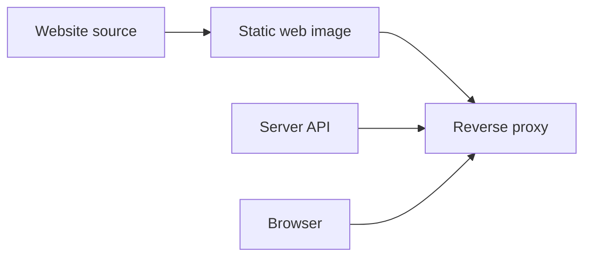

# Website

The website presents the product; it is not the local memory client.

| Assigned domain | Purpose |
|---|---|
| `https://rsrs.rs` | Main product website |
| `https://dash.rsrs.rs` | User dashboard |
| `https://admin.rsrs.rs` | Administration dashboard |
| `https://api.rsrs.rs` | API and synchronization |

| Area | Responsibility |
|---|---|
| Product pages | Website repository; English and Chinese content |
| Account pages | Web frontend integrated with the server |
| Authentication/sync | Server API |
| Local memory operations | CLI / local Web / desktop |

Keep static-web and API deployment separate. A documentation or source update does not automatically update a running website or API.

[Server deployment](../server-deployment.md) · [Local Web](web.md)
