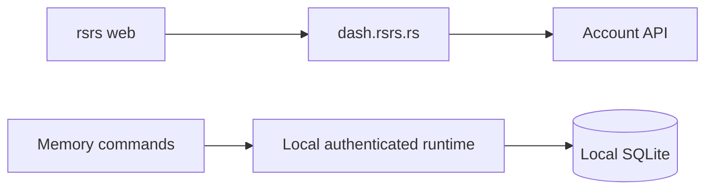

# Dashboard

`rsrs web` opens `https://dash.rsrs.rs` in the browser. It does not start a local website or the background runtime.

| Item | Behavior |
|---|---|
| Dashboard | `https://dash.rsrs.rs` |
| Administration | `https://admin.rsrs.rs` |
| Open the dashboard | `rsrs web` |
| Print the destination without opening a browser | `rsrs web --no-open` |
| Local operations | CLI commands and the authenticated background runtime |

The CLI contains no embedded browser application. Its background runtime continues to handle local commands and queued network synchronization.

The runtime uses port `15169` and `~/.rsrs`. Its local HTTP interface is for authenticated CLI and tool communication, not a dashboard.

[Client](../client.md) · [CLI JSON](../cli-api.md)
