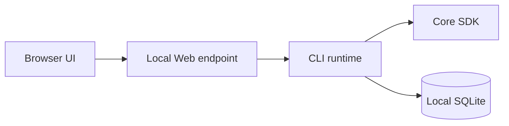

# Local Web

`rsrs web` opens the tree UI in a local browser. Business operations remain in the CLI; this is separate from the marketing website and the Tauri shell.

| Item | Behavior |
|---|---|
| Default address | `http://127.0.0.1:15169`, on the same authenticated Respire runtime |
| UI resources | Embedded in the CLI build |
| Operations | `POST /api/invoke` with command arguments |
| Long tasks | Task ID with polling |
| CLI output | JSON contract |
| Lifecycle | `rsrs web --status`, `--stop`, `--no-open` |

Use a compatible installed CLI. Binding beyond loopback exposes sensitive operations and requires the supported authentication mechanism; do not expose an unauthenticated memory runtime.

Respire Web and its authenticated runtime share port `15169`; there is no additional `5168` or `5169` service. It does not take over an older runtime on `15168`; its local identity is rooted separately at `~/.respire`. The local Web address is distinct from the assigned cloud domains.

[Client](../client.md) · [CLI JSON](../cli-api.md)
