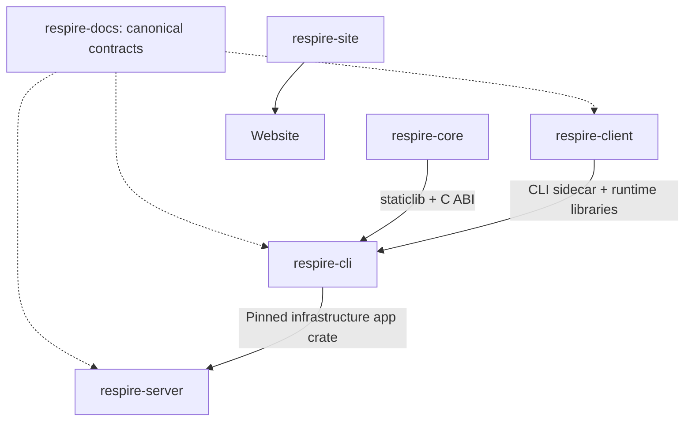

# Repositories

| Repository | Purpose |
|---|---|
| [respire-cli](https://github.com/risense-ai/respire-cli) | CLI plus protocol, crypto, storage, app and safe SDK crates |
| [respire-server](https://github.com/risense-ai/respire-server) | Authentication, encrypted storage, HTTP API and deployment |
| [respire-client](https://github.com/risense-ai/respire-client) | Tree UI and Tauri desktop shell; CLI sidecars |
| [respire-docs](https://github.com/risense-ai/respire-docs) | Documentation and canonical contracts |
| [respire-site](https://github.com/risense-ai/respire-site) | Marketing website source |
| [respire-releases](https://github.com/risense-ai/respire-releases) | Release information and matching binary assets |
| [respire-core](https://github.com/risense-ai/respire-core) | Model execution and memory operations; binary SDK |

CLI/server do not check out Core source or use a Core submodule. The CLI pins an SDK manifest; the server pins the infrastructure app crate revision and uses the same SDK boundary.

| Change | Coordinate |
|---|---|
| Core ABI / SDK | Canonical contract, validated SDK manifest and consumer lock |
| Infrastructure app | CLI source revision and server dependency |
| CLI output | CLI contract and Web/desktop consumers |
| Sidecar | CLI artifact manifest, client compatibility and runtime resources |
