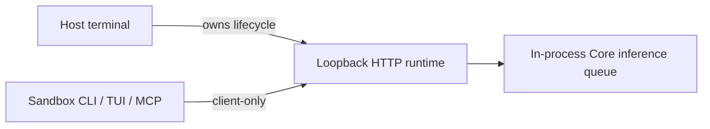

# Host runtime and sandbox clients



| Context | Behavior |
| --- | --- |
| Host | Starts, stops, updates and recovers the runtime |
| Sandbox | Connects to the host loopback runtime; preserves an existing compatibility token |
| Restricted Windows token | Automatically selects client-only mode |
| Other sandboxes | Integration explicitly selects client-only mode |

```sh
# Hosted dashboard (does not start the local runtime)
rsrs web
# Host lifecycle diagnostics
rsrs --runtime-internal
rsrs --runtime-internal --stop
# Sandbox
rsrs --client-only recall "query" --titles --json
```

Client-only mode forbids lifecycle changes, binary copies, upgrades, CPU recovery and
`--direct` execution. MCP stdio does not copy the executable. A failed request never
triggers sandbox takeover. An idle runtime stays running until the host stops it.

Host `account <name>`, `account use <name>`, `space use <name>` and
`config --data-dir <path>` coordinate shutdown, profile selection and restart.
An invalid target keeps the original profile and restarts its service.
Client-only tools cannot switch the host profile. `--direct` still requires a
stopped runtime and does not perform an automatic takeover.

| Setting | Purpose |
| --- | --- |
| `RSRS_CLIENT_ONLY=1` | Host runtime client mode |
| `RSRS_NO_AUTOSTART=1` | Compatibility synonym |
| `RSRS_RPC_PORT` | Override the default port `15169` |

CLI / TUI / MCP stdio connect to `127.0.0.1`. An existing `RSRS_RPC_TOKEN` or
runtime token file is attached on the first health, RPC and stop request for
compatibility with old runtimes. New loopback listeners do not require or create
a token. The runtime
currently rejects non-loopback bind addresses, so cross-machine runtime access
is not supported. Non-loopback peers are never exempt from authentication.
The server checks the actual peer address, not Host or forwarded headers.
Every request must use the bound loopback authority or `localhost` with the
bound port as its Host; when bound to HTTP port 80, Host may omit `:80`.
Origin checks apply to GET and POST alike. MCP endpoints
use the actual bound address.

Keep tokens out of prompts and reports. Remote containers do not automatically
share host loopback addresses.

| Error | Meaning | Action |
| --- | --- | --- |
| `runtime_unavailable` | Runtime unavailable | Host starts the service |
| `runtime_unauthorized` | Authentication rejected | The host verifies the old runtime's existing token and endpoint; do not bypass authentication |
| `runtime_transport` | Connection failed | Host checks endpoint/network |

## Server deployment

| Service | Address |
| --- | --- |
| Main site | `https://rsrs.rs` |
| User dashboard | `https://dash.rsrs.rs` |
| Administration | `https://admin.rsrs.rs` |
| Default API | `https://api.rsrs.rs` |

The default API can be changed through the server settings. Respire uses `~/.rsrs` and port `15169`; startup preserves the selected account and does not import old profiles. Use TUI **Migrate old version** or `rsrs migrate` to choose an explicit source and destination account. Original directories remain intact. Explicit
`ONEMEMORY_*` overrides remain supported, and the database filename and wire format
remain compatible.

## Account login, switching and indexing

`rsrs login` (or `rsrs login --oauth`) authorizes through the hosted dashboard.
`rsrs login --interactive` lets the user choose OAuth or password/TOTP. Supplying
`--pass` explicitly selects password login; `--interactive --oauth` selects OAuth.
The TUI Accounts > Sign in entry offers the same choices. After authentication,
the CLI requests the memory super
password locally and verifies the vault before saving or choosing a profile.
Normal login does not accept `--secret-key` or reset an existing vault. Legacy
decryption material is handled by explicit migration/recovery operations.

After fully migrating an old library with `rsrs migrate --source ... --account ...`, select
that migrated account and run `rsrs migrate --vault`. Supply its original login password,
legacy `--super` passphrase for v2/v3, and v3 `--secret-key` when it is not already
in the session. This operation requires the cloud wrap to match the selected
library. Local migration decrypts all retained records, including tombstones,
and writes a newly encrypted `rsrs.db` using `rsrs:*` key labels. The original
source database remains unchanged. Cloud publication preserves the original URK,
vault factor version, login password and super Key; it does not issue a new
recovery code or silently upgrade the vault to v4. The same login password is
used to recalculate the authentication hash with the current salt label.
Publication requires `/auth/salt` support on the selected API server and a
verified host/runtime account. If confirmation is lost, repeat the explicit
migration with the original credentials; committed matching writes are verified
before completing the local transaction. `--new-super`, if used for compatibility,
must equal the original super Key. A headless host without a keyring supplies
that original Key through `RSRS_SUPER`. Normal login performs no migration.

The host stops the previous runtime, commits the verified session and selected
directory, starts the target runtime and reads back its account and path. Startup
or verification failure restores the prior session and complete client settings,
then restarts the original runtime. The TUI displays success only after readback.
TUI polling connects to the running service without repeatedly trying takeover;
host subprocess diagnostics are captured and rendered inside the interface.

When a usable account has an invalid index, the runtime prepares missing M3
resources and rebuilds derived indexes in the background. Restart resumes pending
work. Progress and download errors appear in the TUI; no rebuild confirmation is
required. Original records, ciphertext and sync state are retained. An explicit
invalid model path or failed download remains an error instead of silently
switching models.

See [Browser authorization and TOTP](browser-api-contract.md) for the API contract
and deployment order. DEV acceptance must exercise the real old binary and
isolated data, both Windows shells, missing-model/restart behavior and both login
methods before publication; unexecuted checks are not passes.

## Hosted dashboard and local transport

`rsrs web` opens `https://dash.rsrs.rs`. `rsrs web --no-open --json` reports that URL without opening a browser. It does not start, stop, or bind the runtime. Former `web --host`, `--port`, `--status`, `--stop`, and `--internal` flags are no longer supported.

The hidden `--runtime-internal` entry is reserved for host lifecycle and automated diagnostics. Commands that require the runtime automatically start it when allowed; restricted clients only connect. Local `/api/health`, `/api/rpc`, `/api/runtime/stop`, `/mcp`, and `/sse` accept actual loopback peers without a token. Non-loopback peers are not exempt from token checks, and non-loopback listening is currently unsupported. Browser pages, static assets, `/api/invoke`, and `/api/task` are removed. The non-loopback authentication gate accepts tokens in headers, never dashboard URLs.

## Upgrading an older runtime

The host command `rsrs --runtime-internal --stop` supports runtimes that still
require a loopback token, including 1.0.9. Health, RPC and stop attach the existing
`RSRS_RPC_TOKEN` or runtime token file on the first request. A failed request is
not replayed. The client does not create or replace credentials. Current loopback
runtimes ignore the compatibility header and work without a token file.
Health checks and normal RPC use the same compatibility rule, so host upgrades
can gracefully stop the old runtime before starting the new executable.

Run lifecycle commands from the host terminal; client-only mode does not permit
shutdown. A missing or rejected legacy token requires the old runtime's existing
authentication material, rather than bypassing authentication or killing an
unverified process. HTTP redirects are disabled for the local runtime client.
