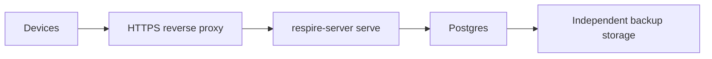

# Self-hosting

Deploy the API with Postgres and an HTTPS entry point. The server stores encrypted records; account decryption keys stay on clients.



## Compose

From the server repository:

```sh
cp .env.example .env
# Fill in deployment secrets and select an available image.
docker compose pull
docker compose up -d
curl -fsS http://127.0.0.1:8787/ready
```

| Configuration | Purpose |
| --- | --- |
| `POSTGRES_PASSWORD` | Required database secret |
| `ONEMEMORY_SERVER_IMAGE` | Explicit image tag |
| `ONEMEMORY_HOST_BIND`, `ONEMEMORY_HOST_PORT` | Host listener; Compose defaults to loopback and port 8787 |
| `ONEMEMORY_ADMIN_TOKEN` | Optional administrative token |

The supplied Compose configuration uses Postgres 16 with database/user `respire` and a separate `respire-pg` volume. It does not reuse the older product's database volume. Existing `ONEMEMORY_*` option names remain explicit compatibility interfaces; cryptographic derivation and sync formats are unchanged. Do not remove the volume during an application upgrade.

## Build prerequisites

| Requirement | Check |
| --- | --- |
| Rust toolchain | Match the repository's pinned toolchain and SDK manifest |
| Binary Core SDK | Obtain a matching artifact for the build target; verify its lock and hashes |
| Runtime libraries and notices | Stage the SDK's required runtime files and licenses |
| Database | Set `DATABASE_URL`; the cloud service has no SQLite fallback |

```sh
node scripts/fetch-core-sdk.mjs x86_64-unknown-linux-gnu
cargo build --release --locked -p respire_service --bin respire-server
docker build -f service/Dockerfile -t respire-server:local .
```

For unattended builds, configure an SDK download URL or provide a complete local SDK matching the lock.

## Backup and upgrade

| Step | Procedure |
| --- | --- |
| Backup | Use Postgres `pg_dump -Fc`; protect credentials and dump files |
| Validate | Inspect the dump and rehearse restoration in an isolated database |
| Upgrade | Back up first, stop old writers, then deploy the selected image |
| Readiness | Verify `/ready`, expected schema and synchronization behavior |
| Recovery | Stop writes before restore; handle synchronization epoch changes deliberately |

For the supplied Compose database:

```sh
docker compose exec -T db pg_dump -U respire -d respire -Fc > respire.dump
```

An old dump omits writes made after its creation. An older application must not write to an unsupported newer schema. See [synchronization v2](sync-v2-rollout.md) for recovery semantics.
