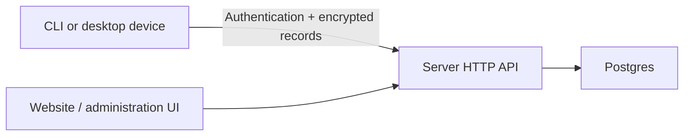

# Server

`respire-server serve` provides authentication and encrypted-record synchronization backed by Postgres. It does not decrypt user records or load retrieval models during ordinary cloud service operation.

## Configuration

| Variable | Purpose |
| --- | --- |
| `DATABASE_URL` | Required Postgres connection string |
| `ONEMEMORY_ADMIN_TOKEN` | Optional administrative entry point |
| `ONEMEMORY_DB_WORKERS` | Database worker pool size, from 1 to 16 |

Keep credentials in the deployment's secret configuration. Do not commit a live connection string or administrative token.

## HTTP interface

| Endpoint family | Purpose |
| --- | --- |
| `GET /health` | Process liveness |
| `GET /ready` | Database and schema readiness; unavailable dependencies produce 503 |
| `/register`, `/login`, `/login/totp` | Account authentication |
| `/oauth/device/code`, `/oauth/token` | Single-use CLI browser authorization after dashboard login/TOTP |
| `/forgot`, `/reset` | Login-password recovery |
| `/api/self/*` | Account settings, sessions, key wrapping and two-factor authentication |
| `/push`, `/push/batch`, `/pull`, `/forget` | Legacy encrypted synchronization |
| `/sync/capabilities` | Capability negotiation |
| `/v2/*` | Operation-based synchronization and conflict decisions |
| `/admin/*` | Authorized administration |

Use the repository's `contracts/openapi.yaml` and route implementation for exact methods and payloads. The OpenAPI file may cover fewer routes than the server; do not infer an undocumented management operation from this overview.

| Administrator role | Scope |
| --- | --- |
| Owner | Administrator management and administrative access |
| Admin | Permitted account and encrypted-record management |
| Viewer | Read-only administrative access |

## Implementation map

| Path | Responsibility |
| --- | --- |
| `service/src/main.rs` | Process entry point |
| `service/src/http/` | Routes, authentication and request boundaries |
| `service/src/store/` | Postgres storage, migrations and synchronization ledger |
| `service/src/totp.rs` | Two-factor authentication |
| `admin-ui/` | Administration frontend |

The server consumes the infrastructure application package from a pinned CLI revision. Its build may therefore need a matching binary Core SDK even though ordinary cloud requests do not perform local model inference.

See [deployment](server-deployment.md), [request boundaries](server-request-boundaries.md) and [synchronization](sync-v2-rollout.md).
