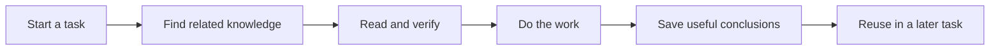

# Why Respire

An agent can lose useful context when a conversation, project or device changes. Respire keeps reusable knowledge outside an individual session so that the user can find, review and maintain it.

| Principle | Product behavior |
| --- | --- |
| Knowledge remains inspectable | Records have identifiers, content and relationships |
| Context can travel | Devices synchronize encrypted records |
| Ownership stays local | Decryption keys remain with the user |
| Interfaces stay simple | CLI, desktop and agent integrations share public behavior |
| Core has a defined boundary | Retrieval and memory policies ship through a binary SDK |

See [getting started](getting-started.md) and [architecture](architecture.md) for the practical workflow.
