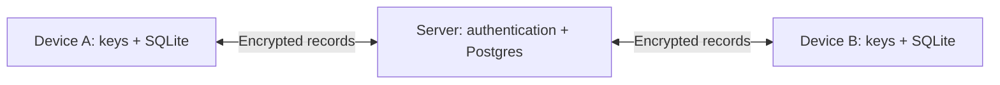
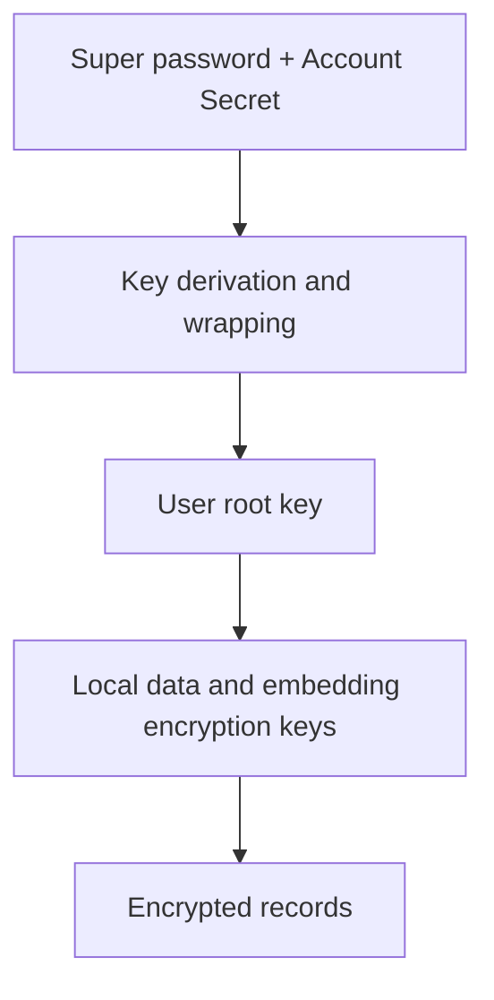

# Synchronization and keys

Synchronization transfers encrypted records. Decryption, local indexing and retrieval happen on the user's device; the server does not need a model or an account decryption key.

| Mode | Behavior |
| --- | --- |
| Local | No configured remote connection |
| Automatic | The runtime schedules synchronization after supported writes |
| Manual | Run `rsrs sync` explicitly |

`RSRS_NO_AUTOSYNC` overrides the account's `client.json` setting. Setting it to a nonzero value disables automatic synchronization. Explicit `sync` waits for the synchronization attempt to finish.

## Record handling

| Mechanism | Purpose |
| --- | --- |
| Dirty records / outbox | Preserve local edits awaiting acknowledgement |
| Ordered server cursor | Download changes without depending on device clocks |
| Tombstone | Synchronize deletion intent |
| Retained versions | Preserve conflicts and history for review |
| Local feature artifact | Rebuildable retrieval data; separate from the encrypted content revision |

See [synchronization v2](sync-v2-rollout.md) for conflict decisions and server recovery.

## Key ownership

| Change | Effect |
| --- | --- |
| Login password | Changes authentication credentials |
| Super password reset | Rewraps the root key; does not rewrite every record |
| New device | Requires authentication and the necessary key-recovery material |
| Logout | Follow `logout --help`; removing local identity is separate from revoking a remote session |

Legacy v1 recovery uses the original login password plus Account Secret, with no separate super password. The wrapping diagram above describes accounts with a separate super/recovery factor; do not request a replacement super password for v1 recovery. Normal login preserves the vault version and encrypted read/write format. Only explicit namespace migration rewrites the selected copy, and it retains the original factors and source.

The server stores opaque vault versions 1 through 4 at `POST /api/self/vault`. For the first upload of recovery material, send `If-None-Match: *` to create only a missing vault. If another vault already exists, the server returns `412` and preserves that vault; the client must read and verify it instead of overwriting it. Invalid fields, versions or unsupported conditions return `400`. A request without the condition keeps the existing upsert behavior and is not safe for first-time recovery initialization.

Keep migration credentials, Account Secret and session files private. Do not add them to repositories or send them through ordinary plugin payloads.

## Backup

| Backup | Contains | Recovery requirement |
| --- | --- | --- |
| `export` | Plaintext records | Protect the exported file |
| `backup` | Local SQLite database | Keep the matching key material |
| Key recovery material | Account secrets or wrapped-key access | Store independently from the database backup |

Before replacing an active database, stop the corresponding runtime and follow the installed restore procedure. Verify a restored copy before relying on a backup.
