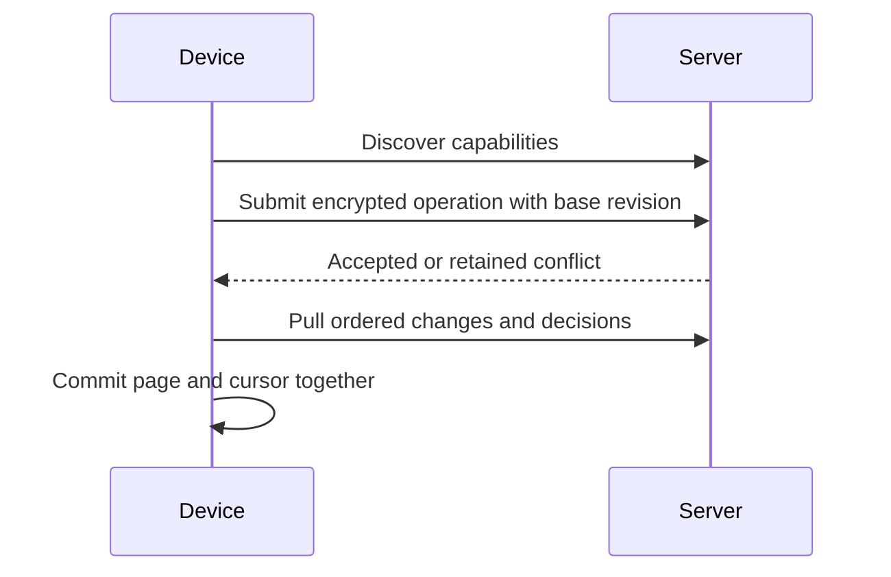

# Synchronization v2

The server negotiates synchronization capabilities with each device. Legacy routes remain compatibility interfaces; a device that has negotiated v2 must not silently fall back to v1.



| Term | Meaning |
| --- | --- |
| `op_id` | Stable operation identity for retry |
| `base_rev` | Revision actually used to make the edit |
| Epoch | Server history identity; changes after deliberate recovery rotation |
| Conflict | Divergent edit retained for review |
| Resolution | Explicit decision with a separate ordered delivery cursor |
| Index pending | Encrypted content exists but local retrieval data needs rebuilding |

## Review and resolve

```sh
rsrs sync-conflicts --refresh
rsrs sync-history --id <id>
rsrs sync-resolve --help
rsrs sync-restore --help
```

| Decision | Result |
| --- | --- |
| Keep current | Retains the current head; stale-head checks protect intervening edits |
| Take incoming | Accepts the selected retained version, including its deletion intent |
| Merge | Creates a new edit from the reviewed content |
| Restore history | Restores a retained version as a new operation |

A conflict is resolved across devices only after the server accepts and distributes the decision. Equal titles, newer timestamps or equal record counts do not prove that two revisions are equivalent.

## Upgrade and recovery

| Phase | Required check |
| --- | --- |
| Before upgrade | Back up Postgres and rehearse restoration in an isolated copy |
| Server upgrade | Stop old writers; allow schema migration to complete before accepting requests |
| Readiness | Verify `/ready`, the expected schema and compatibility routes |
| Client rollout | Upgrade devices separately and observe negotiated capabilities |
| Restore from backup | Stop writes and deliberately rotate the affected account's synchronization epoch |
| Device recovery | Review `sync-reset`, then synchronize while retaining local history and pending edits |

Restoring an old dump discards later server writes. It is a disaster recovery operation, not an ordinary application rollback. Do not run an older writer against a newer unsupported schema.

`sync` does not require loading an embedding model. Rebuild pending local indexes separately with `reembed`. Purging current content does not imply erasing every retained synchronization version.
