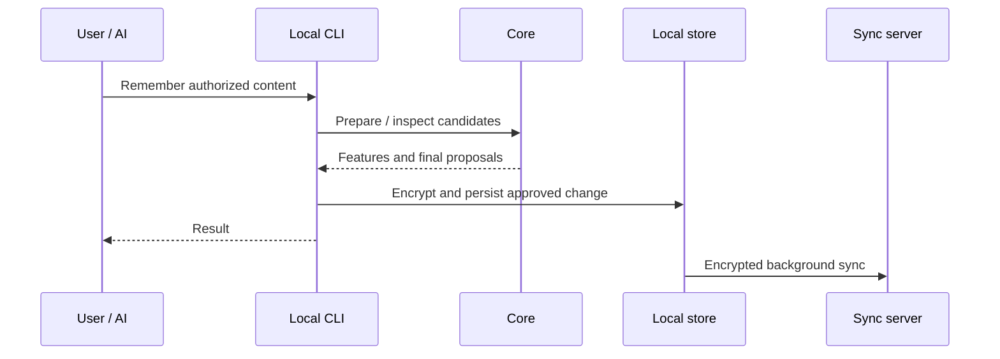

# Walkthrough

Use an installed compatible release. For experimentation, select a separate data directory rather than your working library.

| Step | Command / action |
|---|---|
| Check installation | `rsrs doctor` |
| Choose identity | Register/login for sync, or `keygen` for local-only use |
| Record a decision | `rsrs remember "..." --type decision --title "..." --importance important` |
| Record a diary | `rsrs remember "..." --importance trivial` |
| Find it | `rsrs recall "..." --limit 3` |
| Inspect structure | `rsrs tree`, then `rsrs show <id>` |
| Sync deliberately | `rsrs sync` with a valid server identity |
| Recover another device | Follow [Sync and keys](sync-and-keys.md) using existing account recovery material |

Logging out of the server is different from forgetting local identity. Read each command's help before removing identity information. A plaintext export and an encrypted database backup are different artifacts.

[CLI reference](cli.md) · [Client](client.md)
