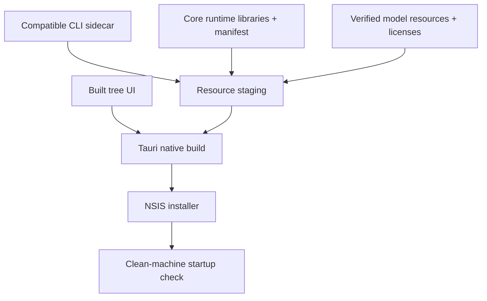

# Windows packaging

A complete Windows desktop package includes more than an executable.

| Resource | Requirement |
|---|---|
| CLI | Version/target must match the client compatibility contract |
| Core runtime | Stage every file declared by the verified runtime manifest |
| Model | Verify the repository's pinned revision/checksums; include model attribution |
| Notices | Preserve SDK, native-library and model license notices |
| WebView2 | Treat as a separate platform runtime, not a substitute for model/Core resources |
| CRT | Match the CLI/SDK dynamic-CRT configuration |

The client's staging scripts and Tauri configuration define actual destination paths. Keep runtime libraries accessible beside the sidecar; verify startup without relying on a developer machine's global caches.

| Validation | Check |
|---|---|
| Before packaging | Sidecar/runtime/model hashes and target |
| After packaging | Resource presence, version and licenses |
| Clean installation | Application starts and model loads |
| Offline behavior | Verify what resources the installer includes; do not assume every installer is fully offline |

[Client integration](CLIENT-GUIDE.md)
